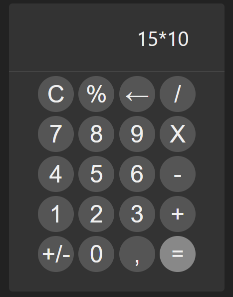

# Calculator
## (UNFINISHED)
#### simple calculator made with React JS

## Made with:

*  HTML 5

*  CSS 3

*  Javascript

*  React

## Running:

type the following commands in the terminal to run

1. `npm start`
